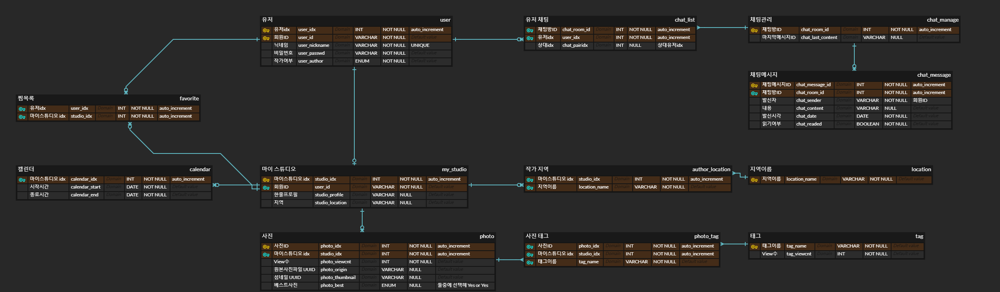
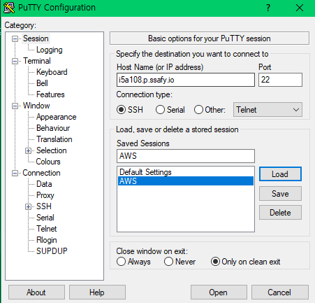
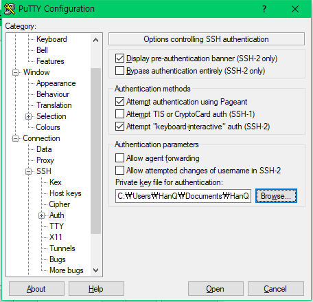
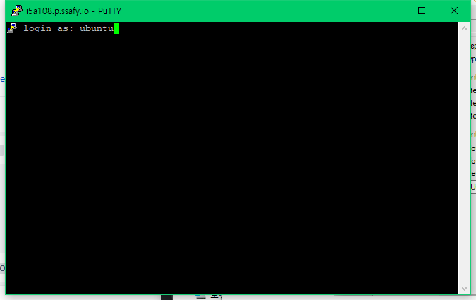
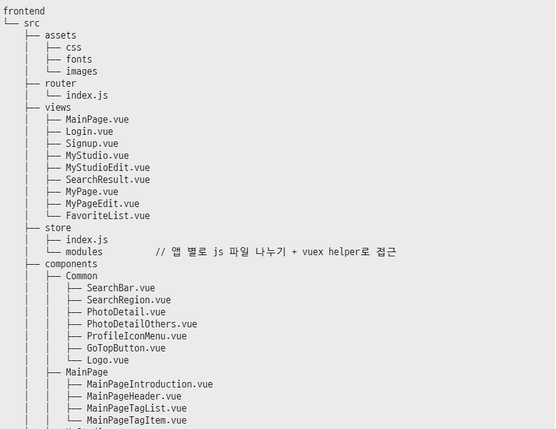
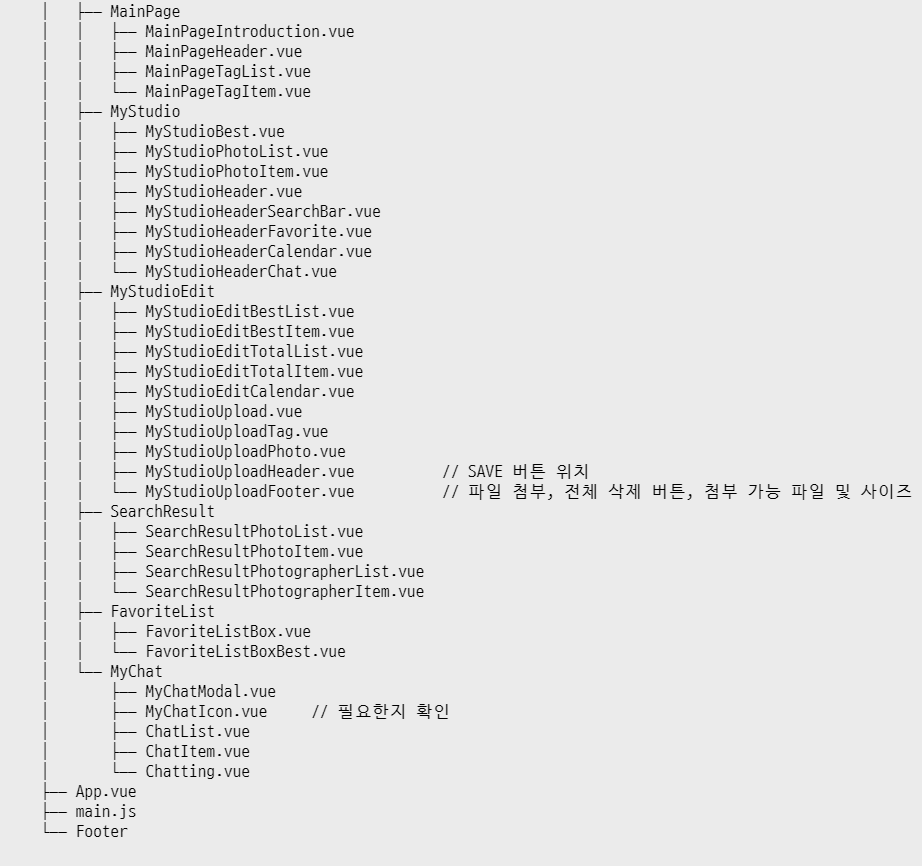

# README

> SSAFY Seoul A108 조 프로젝트

### Commit Message Rule

자세한 사항은 [210720 회의록](회의록/210720 회의록.md) 참조

### ER-Diagram 구조

#### PUTTY로 AWS 접속 방법

Host Name : [i5a108.p.ssafy.io](http://i5a108.p.ssafy.io) Port : 22

Connection - SSH - Auth 에서 ppk 넣기

ubuntu 계정으로 접속

### 프론트엔드 컴포넌트 구조

