# README.md

# **Photo-it**

## **Description**

사진 작가 - 모델이 컨택할 수 있도록 도와주는 플랫폼 입니다. 사진 작가는 자신의 사진을 포트폴리오 처럼 올릴 수 있고, 모델들은 그 사진들을 보며 마음에 드는 작가와 컨택할 수 있습니다. 태그, 작가, 작가 위치 별 검색이 가능하고 마음에 드는 작가를 찜할 수 있습니다.

## **Environment & Tech Stack**

- BackEnd(IntelliJ) : Spring boot, JPA, Redis, MySql, Jenkins, NginX, Docker, AWS
- FrontEnd(NodeJS) : Vue.js

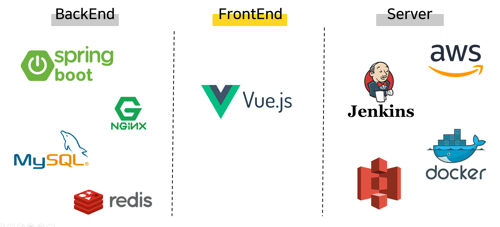

## Requirements

- IDE : IntelliJ, Visual Code
- module
    - frontend : vue-cli

## **Participants**

- 박세령 : backend
- 김상재 : frontend
- 김지현 : frontend, backend
- 신한규 : DB, frontend, backend
- 이은총 : frontend
- 이희정 : server, backend, frontend

## **Service URL**

**📌 https://i5a108.p.ssafy.io**

## **Usage**

> 메인페이지 (https://i5a108.p.ssafy.io)

- Page

    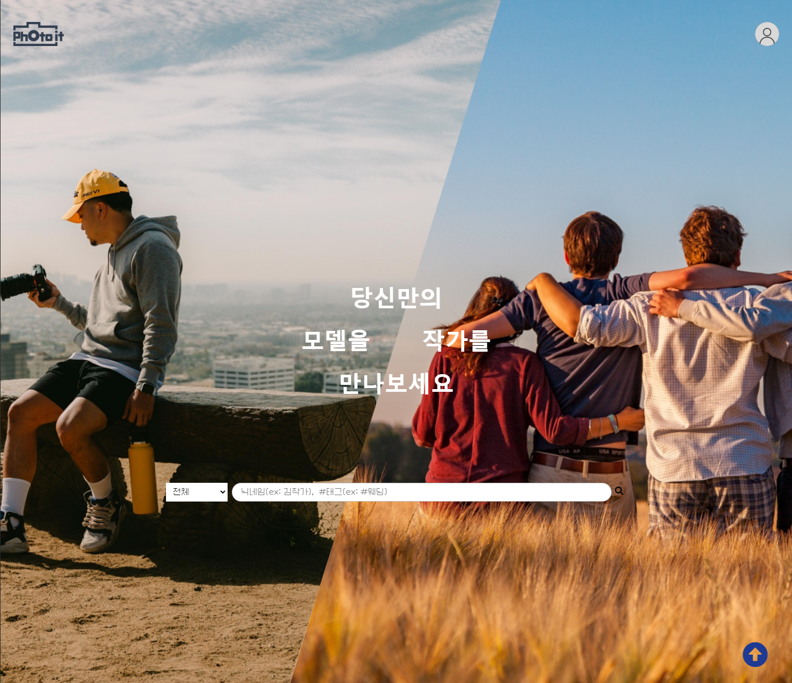

- 접근 방법 : 서비스 URL에 접근 시 가장 처음 보이는 페이지
- 주요 기능: 검색, 조회수가 높은 태그 4개의 사진을 최신순으로 n개 확인 가능, 디테일(+ 찜)
- Service Functions
    - locationList() : 저장된 지역들을 불러오기
        - 요청 : 없음
        - 응답
            - MainPageLocationRes

                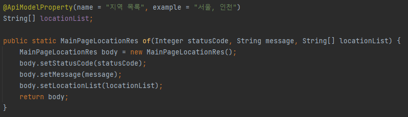

            - 응답 코드

                

    - tagList() : 사진 태그들을 가져오기
        - 요청 : 없음
        - 응답
            - MainPageTagPhotoRes

                

            - 응답 코드

                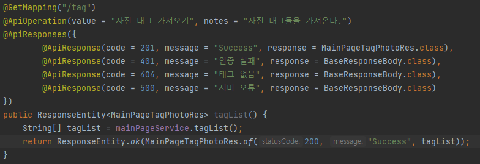

    - mainPageContents() : 메인콘텐츠(사진태그,썸네일, 닉네임) 가져오기
        - 요청 : 없음
        - 응답
            - MainPageTagPhotoRes

                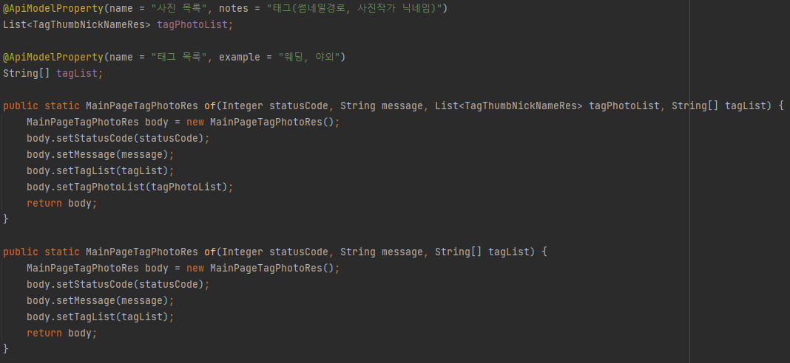

            - 응답 코드

                

    - photoDetail() : 사진 디테일 콘텐츠(원본사진 경로, 원본사진 태그List, 찜 여부, [썸네일경로, 사진ID] N개
        - 요청 : 없음
        - 응답
            - MainPagePhotoDetailRes

                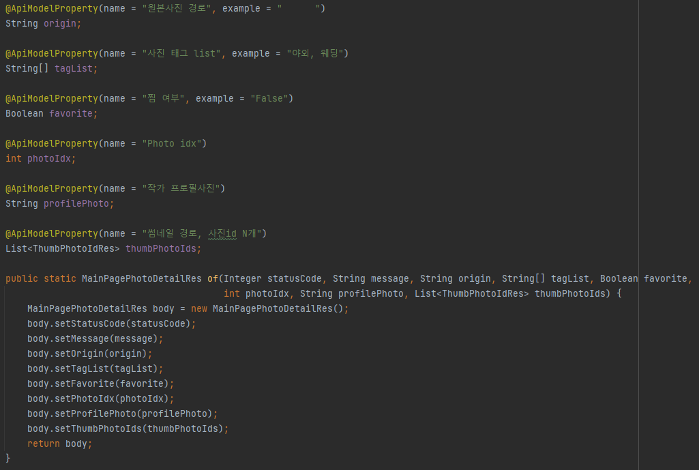

            - 응답 코드

                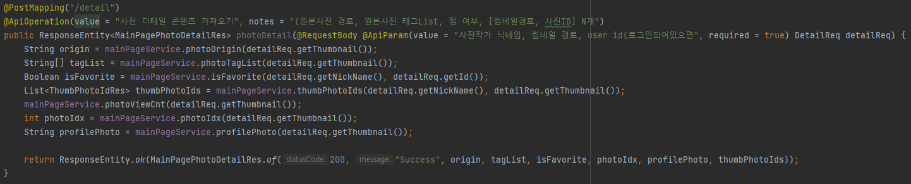

    - userProfile() : 프로필 사진, 닉네임 가져오기
        - 요청 : 없음
        - 응답
            - MainPageProfileRes

                

            - 응답 코드

                

> 회원가입 (https://i5a108.p.ssafy.io/signup)

- Page

    

- 접근 방법 : 메인페이지 오른쪽 상단의 프로필 아이콘을 눌러 나오는 드롭다운에서 회원가입 선택
- Service Functions
    - signUp() : 회원가입
        - 요청(UserReq)

            

        - 응답
            - BaseResponseBody
            - 응답코드

                

> 로그인 (https://i5a108.p.ssafy.io/login)

- Page

    

- 접근 방법 : 메인페이지 오른쪽 상단의 프로필 아이콘을 눌러 나오는 드롭다운에서 로그인 선택
- Service Functions
    - signin() : 로그인
        - 요청(UserReq)

            

        - 응답
            - UserLoginPostRes

                

            - 응답코드

                

> 로그아웃

- Page

    

- 접근 방법 : 로그인 후, 오른쪽 상단의 프로필 아이콘을 눌러 나오는 드롭다운에서 로그아웃 선택
- Service Functions
    - signOut() : 로그아웃
        - 요청 :

            

        - 응답
            - BaseResponseBody
            - 응답코드

                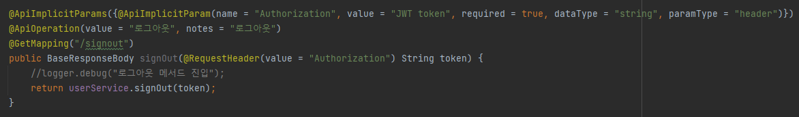

> 마이페이지 (https://i5a108.p.ssafy.io/mypage)

- Page

    

- 접근 방법 : 로그인 후 오른쪽 상단의 프로필 아이콘을 눌러 나오는 드롭다운에서 마이페이지 선택
- 주요 기능: 회원 정보 확인 및 수정
- Service Functions
    - getProfile() : 마이페이지 진입시 해당 회원의 정보를 모두 불러온다
        - 요청

            

        - 응답
            - MyPageGetRes

                

            - 응답 코드

                

    - updateProfile : 회원정보 수정
        - 요청

            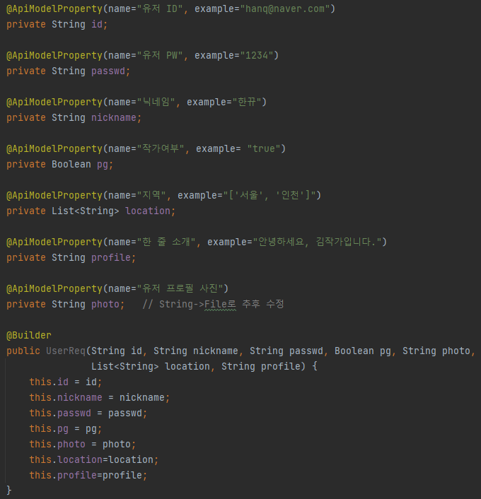

        - 응답
            - UserLoginPostRes

                

            - 응답코드

                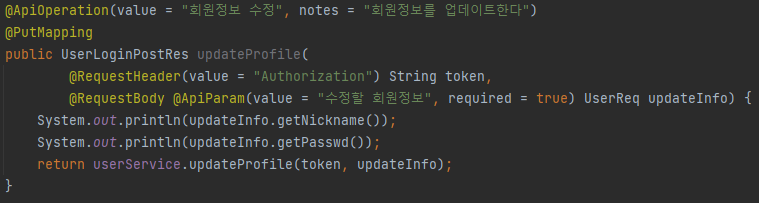

    - deleteUser() : 회원 탈퇴
        - 요청

            

        - 응답
            - BaseResponseBody
            - 응답코드

                

    - upgradePhotographer() : 작가로 업그레이드
        - 요청

            

        - 응답
            - BaseResponseBody
            - 응답코드

                

    - isPasswordRight() : 비밀번호 재확인
        - 요청

            

        - 응답
            - BaseResponseBody
            - 응답코드

                

    - nicknameDuplicateCheck() : 닉네임 중복체크
        - 요청

            

        - 응답
            - BaseResponseBody
            - 응답코드

                

    - editProfilePhoto() : 프로필사진 수정
        - 요청

            

        - 응답
            - BaseResponseBody
            - 응답코드

                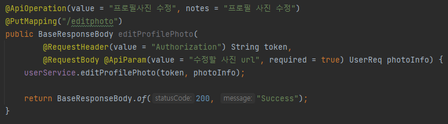

> 마이스튜디오 (https://i5a108.p.ssafy.io/mystudio)

- Page

    

- 접근 방법
    - 작가일 때, 로그인 후 오른쪽 상단의 프로필 아이콘을 눌러 나오는 드롭다운에서 로그아웃 선택 또는 작가 검색,찜목록에서 해달 작가 클릭
    - 일반인일 때, 로그인 후 작가 검색,찜목록에서 해달 작가 클릭
- 주요 기능: 사진 작가가 올린 전체 사진 확인 가능, 애니메이션과 자체 정렬 방식이 적용된 페이지 레이아웃 제공, 사진 작가가 뽑은 베스트 사진 3 캐러셀로 확인 가능
- Service Functions
    - getPgProfile() : 작가 프로필(한줄 프로필, 지역) 받아오기
        - 요청 : 쿼리  /{nickname}
        - 응답
            - StudioPgProfileResBody

                

            - 응답 코드

                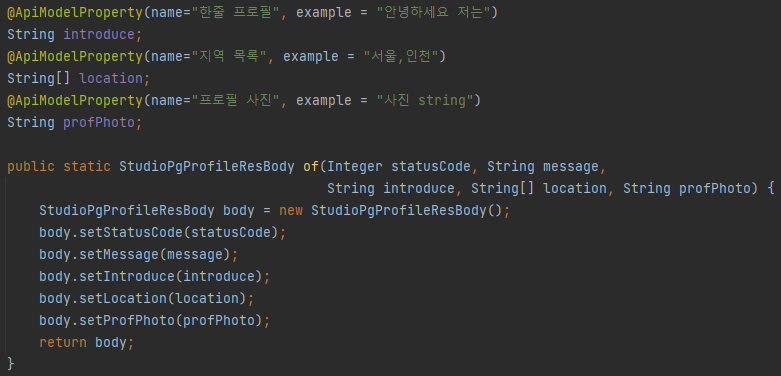

    - showCalendar() : 일정 보여주기
        - 요청 : 쿼리  /{nickname}
        - 응답
            - StudioCalendarResBody

                

            - 응답 코드

                

    - addCalendar() : 일정 추가하기
        - 요청

            

        - 응답
            - BaseResponseBody(T/F)
            - 응답코드

                

    - deleteCalendar() : 일정 삭제하기
        - 요청

            

        - 응답
            - BaseResponseBody(T/F)
            - 응답코드

                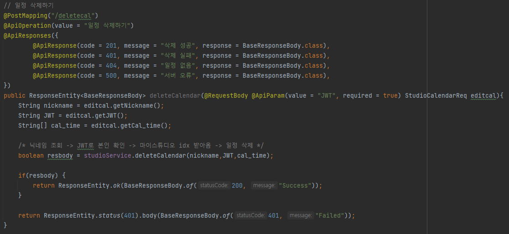

    - getBestPhotos() : 베스트 3 사진 받아오기
        - 요청 : 쿼리  /{nickname}
        - 응답
            - StudioGetPhotosResBody

                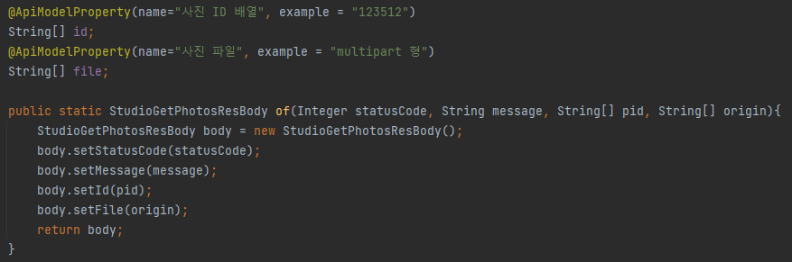

            - 응답코드

                

    - getAllPgPhotos() : 작가 전체사진 받아오기
        - 요청 : 쿼리  /{nickname}
        - 응답
            - StudioGetPhotosResBody

                

            - 응답코드

                

> 마이스튜디오 Edit ([https://i5a108.p.ssafy.io/mystudioedit/{닉네임}](https://i5a108.p.ssafy.io/mystudioedit/%ED%95%9C%EB%80%A8))

- Page

    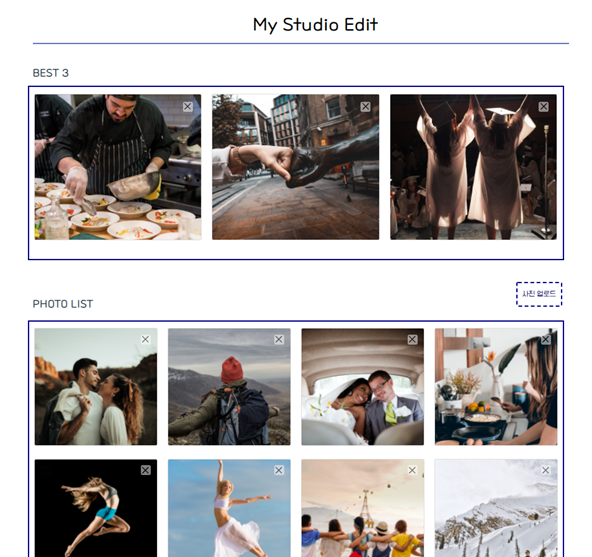

- 접근 방법 : 프로필 아이콘 드롭다운의 Edit 버튼을 클릭
- 주요 기능: 마이스튜디오에 업로드할 사진 추가, 기존 업로드된 사진 삭제, 베스트 사진 3 선정 및 취소
- Service Functions
    - studioAuth() : 마이스튜디오 본인확인
        - 요청 : 쿼리  /{nickname}
        - 응답
            - BaseResponseBody
            - 응답코드

                

    - getPgProfile() : 작가 프로필 받아오기
        - 요청

            

        - 응답
            - StudioEditPgProfileResponseBody

                

            - 응답코드

                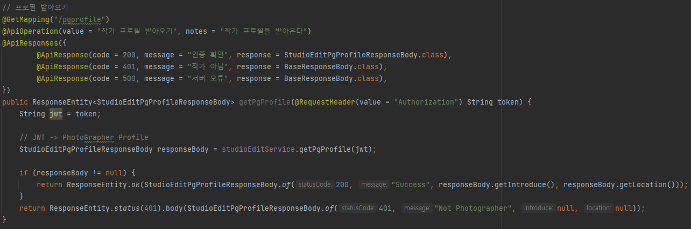

    - getBestPhoto() : 베스트3 사진 받아오기
        - 요청

            

        - 응답
            - StudioEditPhotoResponseBody

                

            - 응답코드

                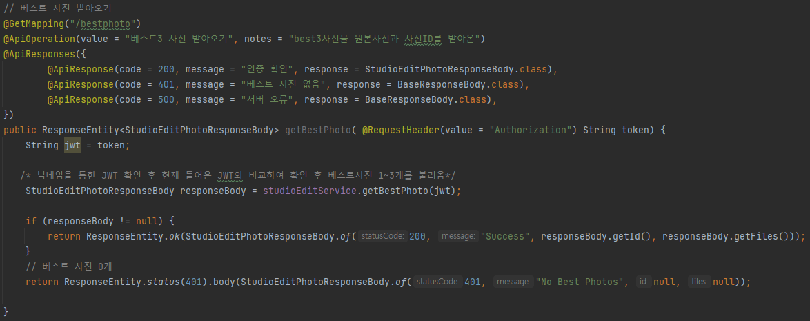

    - getPgPhoto() : 작가 전체 사진 받아오기
        - 요청

            

        - 응답
            - StudioEditPhotoResponseBody

                

            - 응답코드

                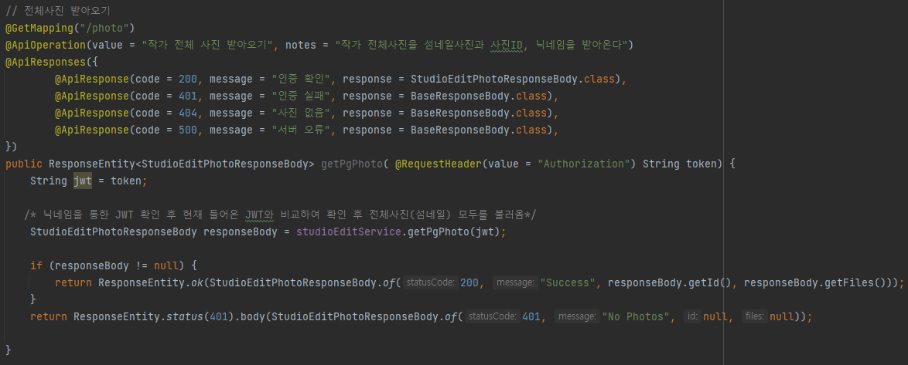

    - addBestPhoto() : 베스트3 사진 추가하기
        - 요청(StudioEditPhotoSelectReq)

            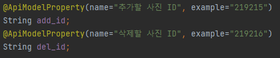

        - 응답
            - BaseResponseBody
            - 응답코드

                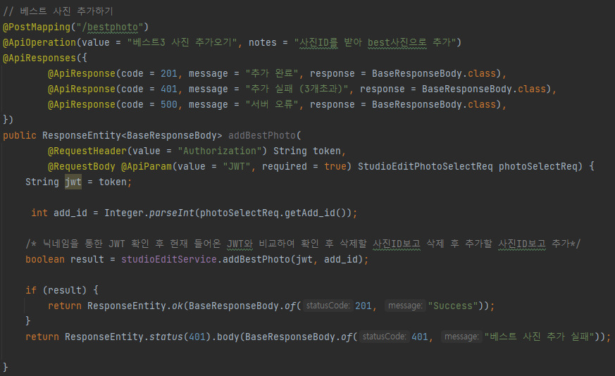

    - updateBestPhoto() : 베스트3 사진 수정하기
        - 요청(StudioEditPhotoSelectReq)

            

        - 응답
            - BaseResponseBody
            - 응답코드

                

    - delBestPhoto() : 베스트3 사진 삭제하기
        - 요청(StudioEditPhotoSelectReq)

            

        - 응답
            - BaseResponseBody
            - 응답코드

                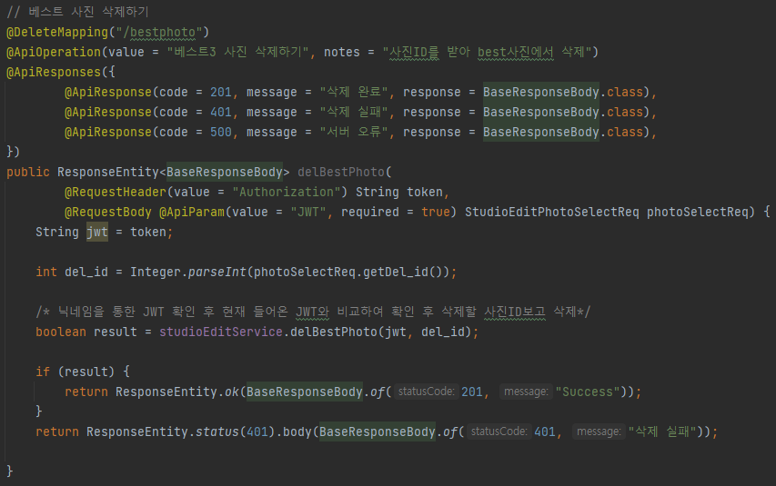

    - addPgPhoto() : 작가 전체 사진 추가하기
        - 요청(StudioEditPhotoUploadReq)

            

        - 응답
            - BaseResponseBody
            - 응답코드

                

    - delPgPhoto() : 작가 전체 사진 중 하나 삭제하기
        - 요청(StudioEditPhotoSelectReq)

            

        - 응답
            - BaseResponseBody
            - 응답코드

                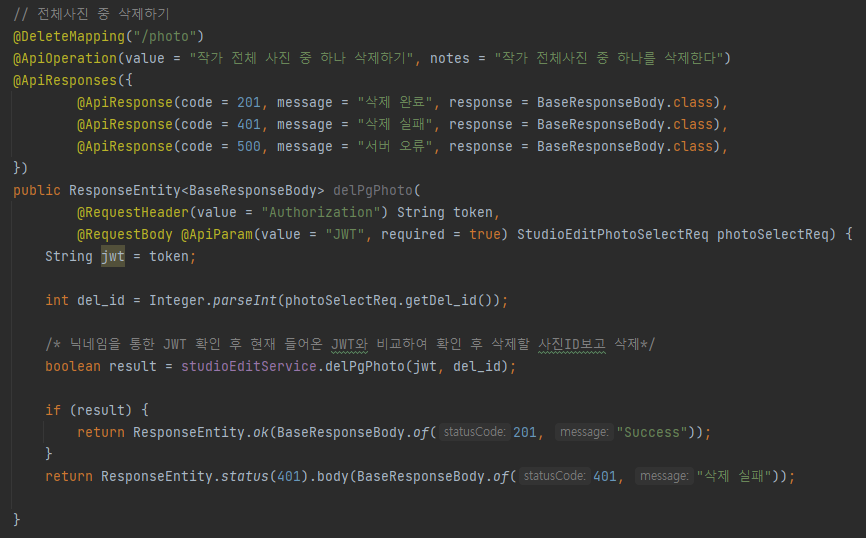

> 찜 (https://i5a108.p.ssafy.io/fav)

- Page

    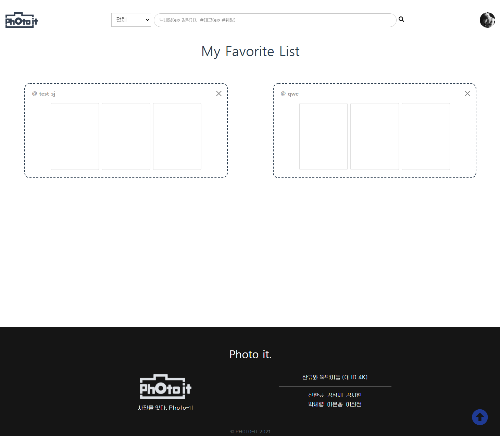

- 접근 방법 : 로그인 후 오른쪽 상단의 프로필 아이콘을 눌러 나오는 드롭다운에서 찜목록 선택
- 주요 기능: 작가의 마이스튜디오, 사진 디테일에서 원하는 작가를 찜하면 찜목록 페이지에서 확인 가능, 작가와 작가의 베스트 사진 3 모아보기 가능
- Service Functions
    - addFav() : 찜 추가하기
        - 요청

            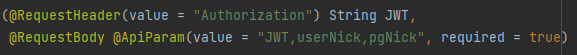

        - 응답
            - BaseResponseBody(T/F)
            - 응답코드

                

    - deleteFav() : 찜 해제하기
        - 요청

            

        - 응답
            - BaseResponseBody(T/F)
            - 응답코드

                

    - checkFav() : 사진 확대 시 작가 이름 옆의 찜 확인
        - 요청

            

        - 응답
            - BaseResponseBody(T/F)
            - 응답코드

                

    - getFavList() : 찜목록 불러오기
        - 요청 : 쿼리  /{nickname}
        - 응답
            - FavResBody

                

            - 응답코드

                

> 검색

- Page

    

    

- 접근 방법 : 메인페이지, 마이페이지, 찜목록 등의 상단 nav바에서 검색어 입력
- 주요 기능: 태그 검색 및 사진 디테일(+ 찜), 작가 검색 및 작가의 마이스튜디오 이동, 태그 자동 완성
- Service Functions
    - searchTagLocation() : 해당 지역,태그 사진 가져오기
        - 요청

            

            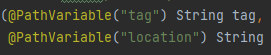

        - 응답
            - SearchTagLocationRes

                

            - 응답코드

                

    - searchPg() : 해당 지역, 작가 검색
        - 요청

            

            

        - 응답
            - SearchPgLocationRes

                

            - 응답코드

                

    - searchMyStudioTag() : 마이스튜디오 내 태그검색
        - 요청
        - 응답
            - SearchMyStudioTagRes

                

            - 응답코드

                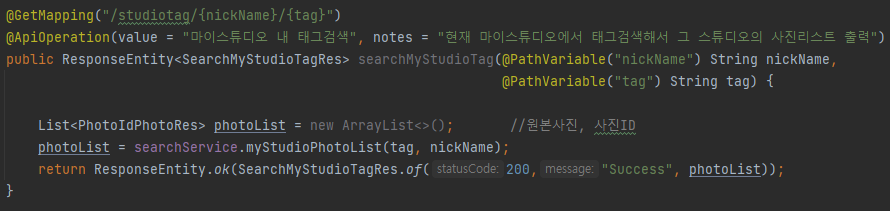

> 쪽지 ([https://i5a108.p.ssafy.io/chat/roomlist](https://i5a108.p.ssafy.io/chat/roomlist))

- Page

    

    

- 접근 방법 : 작가 스튜디오 상단의 비행기 아이콘을 클릭 또는 오른쪽 상단 프로필 아이콘을 눌러 나오는 드롭다운에서 쪽지함 선택
- 주요 기능: 쪽지함, 쪽지 수신 및 발신
- Service Functions
    - createRoom() : 채팅 roomId, 내용 받기
        - 요청(ChatUsersReq)

            

        - 응답
            - ChatRoomRes

                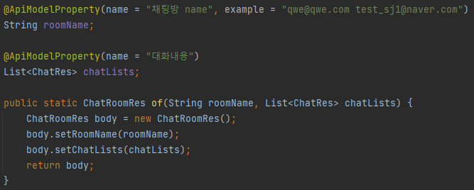

            - 응답코드

                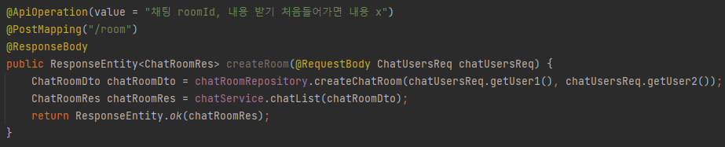

    - roomList() : 사용자의 채팅 목록 불러오기
        - 요청(ChatReq)

            

        - 응답
            - ChatRoomRes

                

            - 응답코드

                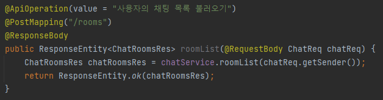

## How to work Server

**👉 BACKEND - [README.md](./backend/readme.md) 👈**

