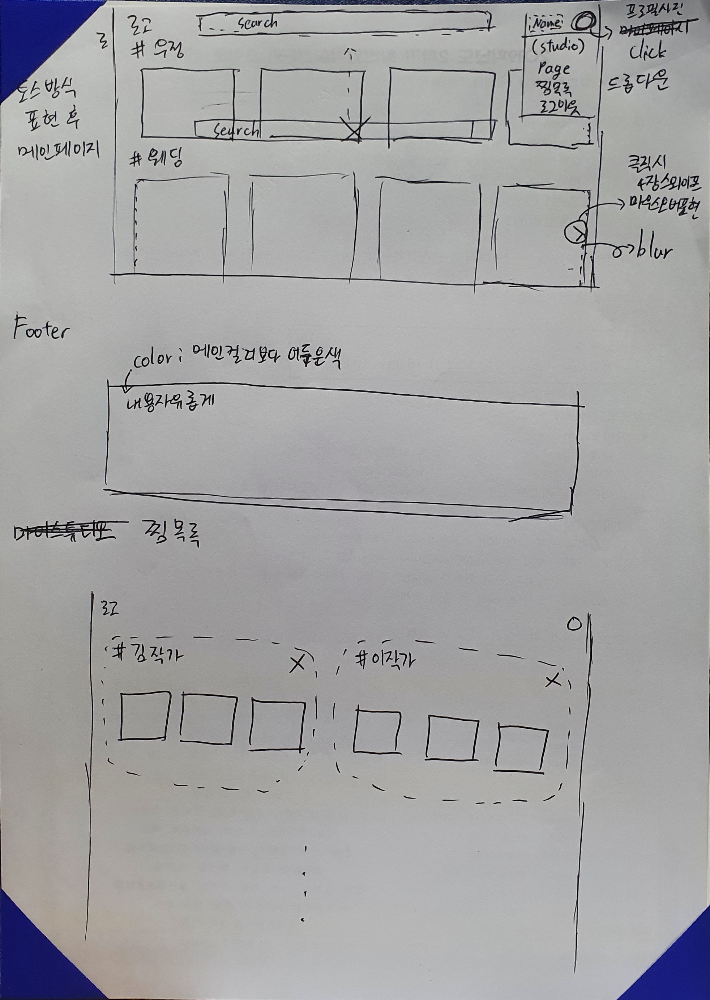
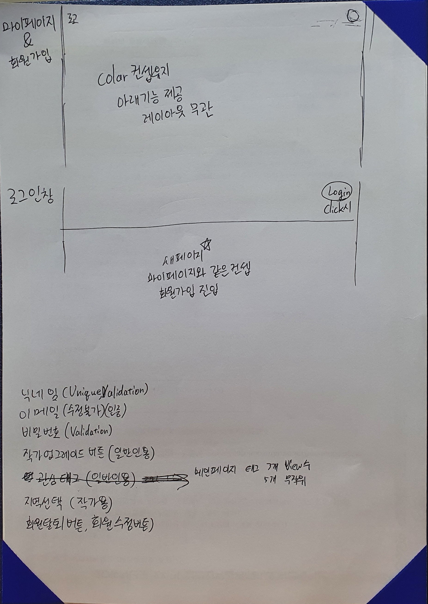
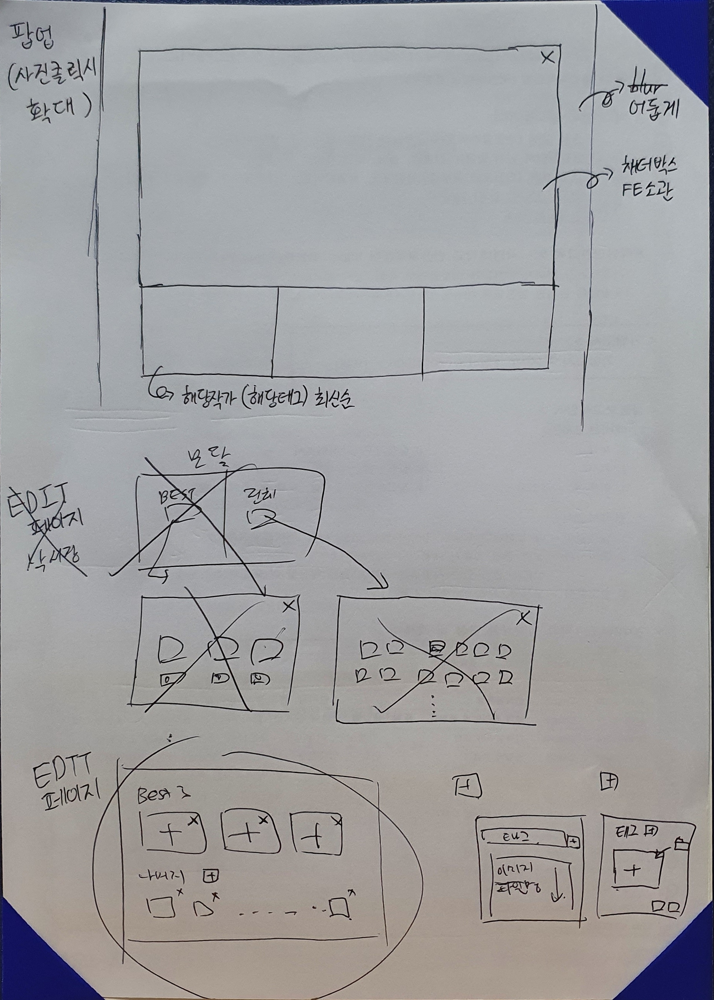
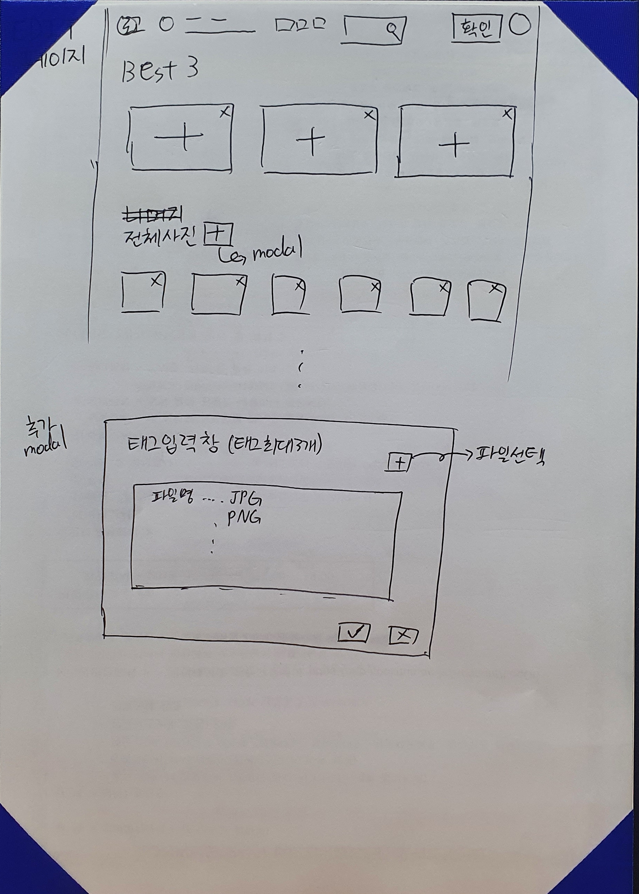
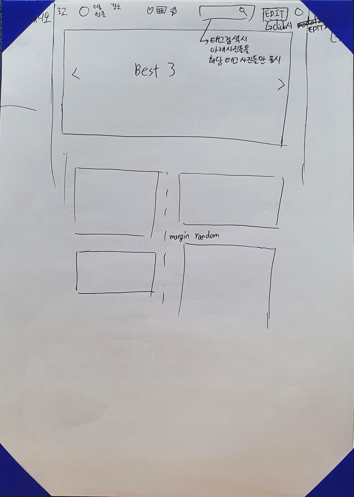
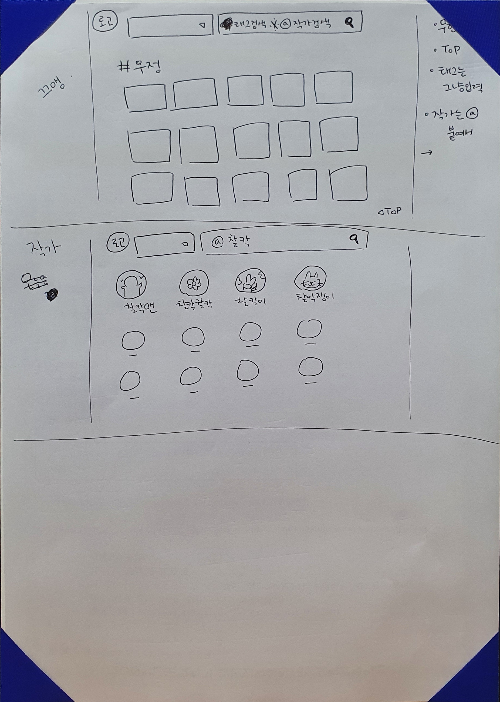
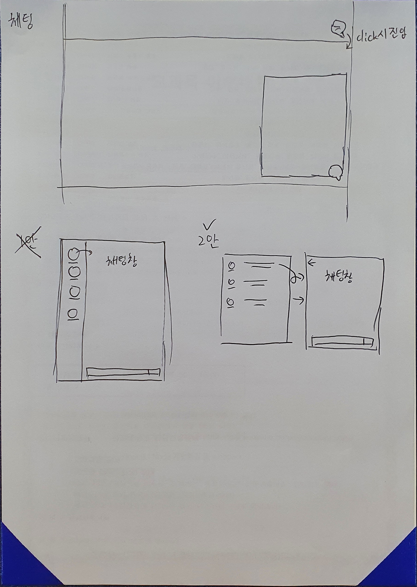

# 210721 회의록

> 와이어프레임 작성을 위해 모여서 회의 진행
>
> 5인 이상 규제 때문에 2인은 지라, 깃, mm 연동 및 이슈 등록 관련 업무 진행

## 와이어프레임

> 간단하게 손으로 직접 스케치를 진행했으며 결과물은 아래와 같다.

위 와이어 프레임 초안을 가지고 목업 디자인을 진행할 것이고, figma로 진행예정.

## 추가로 논의해야 할 사항

1. 와이어 프레임 마무리 못한 것 (BEST 3 컷 업로드 방법)
2. 역할 분배 (ERD / 컴포넌트 구조 / 목업 진행)

